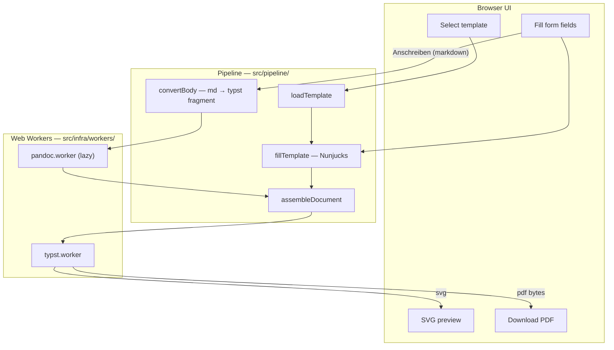

# Letter Writer Web App — Client-Only Plan (Pandoc WASM + Typst WASM + letter-pro)

## Summary

Build a **fully static, client-only** letter-writing web app. Users pick a built-in template, fill a generated form, see a **true WYSIWYG preview** (Typst → SVG), and download a **DIN 5008-quality PDF** — all in the browser, no server.

**Stack:** Vite + React + TypeScript + Tailwind · Nunjucks templating (behind adapter) · `@myriaddreamin/typst.ts` + `letter-pro` · `pandoc-wasm` for Markdown body conversion.

**Code-quality constraints (all phases):**

- No file > **400 lines**; target **< 200 lines** per module.
- Domain logic lives outside React components; UI components are presentational.
- Shared logic is extracted once — no copy-paste between workers, hooks, and tests.
- Every pipeline stage has a typed interface and dedicated unit tests before integration.

---

## Dependency Health Assessment (2026-06)

| Library | Verdict | Notes |
|---------|---------|-------|
| `@myriaddreamin/typst.ts` (+ web-compiler, renderer) | **Healthy — primary choice** | ~22k npm weekly downloads; v0.7.0 (Jun 2026) tracks Typst 0.14; active CI, Apache-2.0. Pin exact version; import from `@myriaddreamin/typst.ts/compiler` for tree-shaking in workers. |
| `pandoc-wasm` | **Healthy but heavy — use deliberately** | Official Pandoc org repo since Feb 2026; includes Pandoc 3.9 WASM; ~16 MB gzip; **GPL-2.0-or-later**. Low npm stars (young wrapper) but backed by Pandoc maintainers. Lazy-load only. |
| `letter-pro` (vendored `@local/letter-pro:3.0.0`) | **Adequate — pin and vendor** | MIT; ~200 GitHub stars; v3.0.0 (Oct 2024); single primary maintainer, 19 open issues. Vendor at fixed tag; add upgrade script + visual regression test before bumping. |
| `nunjucks` | **Stable but low maintenance — isolate** | v3.2.4 (Apr 2023); ~3M weekly downloads; Mozilla no longer maintains; one volunteer maintainer, v4 rewrite stalled. **Pin 3.2.4**; wrap in `TemplateEngine` adapter so we can swap to Handlebars or a minimal engine without touching pipeline code. |
| `markdown2typst` | **Immature — fallback only** | MIT, ~80 weekly downloads, first published Jan 2026. Useful as a **lightweight, non-GPL body converter** behind the same adapter if pandoc bundle proves unacceptable; not primary until parity tests pass. |
| Vite, React, Vitest, Tailwind | **Healthy** | Standard choices; use current stable majors. |

**Rejected (previous plan):** server pandoc + LaTeX — excellent quality but requires TeX Live, Docker, and preview ≠ PDF.

**Rejected:** `markdown-pdfjs` — immature, no DIN letter support.

---

## Why This Architecture

| Requirement | How it is met |
|-------------|---------------|
| No backend | Static SPA deployable to any CDN |
| High-quality formal letters | [letter-pro](https://typst.app/universe/package/letter-pro/) — DIN 5008 Typst template |
| Live preview ≈ PDF | Same Typst source compiled to SVG (preview) and PDF (download) via typst.ts |
| Markdown body support | Body converter adapter: primary `pandoc-wasm` (md → typst fragment); optional `markdown2typst` fallback |
| Default field values | Nunjucks `{{ field \| default("…") }}` in template + companion JSON schema |
| Maintainable codebase | Layered modules (`domain/`, `pipeline/`, `infra/`, `ui/`); typed stage interfaces; phase review gates |

---

## Document Pipeline

The end-to-end path replaces the legacy **md template → filled md → pandoc PDF** flow with a staged pipeline that preserves the same user-facing steps (template → form → body markdown → PDF):



### Stage contracts (typed, one module each)

| Stage | Input | Output | Module |
|-------|-------|--------|--------|
| 1. Load template | template id | `{ shell: string, schema: Schema }` | `domain/templates/loadTemplate.ts` |
| 2. Build context | form values + schema | `LetterContext` | `domain/letter/buildContext.ts` |
| 3. Fill shell | shell + context | `filledShell: string` (valid Typst) | `pipeline/stages/fillTemplate.ts` |
| 4. Convert body | markdown or plain text | `bodyTypst: string` | `pipeline/stages/convertBody.ts` |
| 5. Assemble | shell + body | `mainContent: string` | `pipeline/stages/assembleDocument.ts` |
| 6. Compile | mainContent | `{ svg: string, pdf: Uint8Array }` | `pipeline/stages/compileTypst.ts` (delegates to worker) |

Orchestration lives in **`pipeline/letterPipeline.ts`** only — no stage logic in React components or workers beyond thin I/O adapters.

### Step-by-step

1. **Load template** — `letter.typ` (Nunjucks placeholders) + `letter.schema.json` (form UI).
2. **Fill shell** — Nunjucks merges user values with defaults into a Typst document that `#import`s `letter-pro` and sets `sender`, `recipient`, `subject`, `date`, `reference-signs`, etc.
3. **Convert body** — If `Anschreiben` is Markdown, run body converter (`pandoc-wasm`: `{ from: "markdown", to: "typst", wrap: "none" }`). Plain-text bodies use `plainTextToTypst()` in JS (no pandoc).
4. **Assemble** — Inject `bodyTypst` into the filled shell at a fixed placeholder marker (`{{ body_typst }}` is replaced **after** Nunjucks, not inside the `.typ` file).
5. **Compile** — typst worker: `$typst.svg()` for preview and `$typst.pdf()` for download from the **same** assembled source.
6. **Debounce** — ~300 ms debounce on form changes; show loading state during WASM compile (~200–800 ms).

---

## Template Design

### Migrate away from [templates/letter.md](templates/letter.md)

The current file uses pandoc/LaTeX conventions (`\today`, `\bigskip`, `${var:=default}`). Replace with:

| Old concept | New representation |
|-------------|-------------------|
| `${Rueckadresse:=…}` | Nunjucks in schema defaults + `{{ Rueckadresse \| default("…") }}` in `.typ` |
| YAML front matter | `letter.schema.json` field definitions |
| `#yourmail:` reference lines | `reference-signs` tuple in letter-pro API |
| `${Anschreiben}` body | Separate form field; injected **post-Nunjucks** via `assembleDocument` |
| LaTeX `\today` | JS `Intl.DateTimeFormat('de-DE')` default or Typst `#datetime.today().display()` |

Keep `templates/letter.md` during Phase 1 only as a **reference fixture** for parity tests (map its field names to schema keys; do not ship it to production UI).

### `templates/letter.typ` (Nunjucks-processed, then Typst)

```typ
#import "@local/letter-pro:3.0.0": letter-simple
#set text(lang: "de")

#show: letter-simple.with(
  sender: (
    name: "{{ Absender_Name }}",
    address: "{{ Absender_Adresse | default('Berrenrather Str. 150, 50354 Hürth') }}",
  ),
  recipient: [
    {{ Empfaenger_typst }}
  ],
  reference-signs: (
    
    ([{{ ref.label }}], [{{ ref.value }}]),
    
  ),
  date: "{{ Datum | default(today_de) }}",
  subject: "{{ Betreff }}",
)

/* BODY_INJECT */
```

- Nunjucks runs **in JavaScript before** Typst sees the file.
- `/* BODY_INJECT */` is replaced by `assembleDocument` with the converted body Typst — **not** processed by Nunjucks (avoids `#`/`[` conflicts in user markdown).
- Output must be valid Typst; user strings go through `typstEscape.ts`.

### Shared form schema (multi-template contract)

**One canonical schema drives the form for every template.** Users pick a letter *style* in the UI; filled fields (`Absender`, `Empfänger`, `Betreff`, `Datum`, `Anschreiben`, reference lines) stay intact when switching templates.

| File | Role |
|------|------|
| `templates/shared.schema.json` | Canonical field IDs, labels, types, defaults — **single source of truth** |
| `templates/{id}.schema.json` | Thin wrapper: `"extends": "shared"` or identical copy (CI validates parity) |
| `templates/{id}.typ` | Nunjucks adapter shell: maps shared context → library-specific API |
| `templates/{id}.meta.json` | Catalog entry: `title`, `description`, `preview`, `package` pin |
| `templates/catalog.json` | Ordered list of template IDs for `TemplatePicker` |

Field IDs are stable across templates (`Absender_Name`, `Absender_Adresse`, `Empfaenger`, `Betreff`, `Datum`, `Anschreiben`, optional `reference_signs`, optional `Ort`). Each shell ignores fields the underlying library does not support.

Renaming the current default template id from `letter` → `letter-pro` is recommended in Phase 3 for clarity (with migration in `useDraftPersistence`).

Research and API mapping details: [typst-letter-templates.md](../notes/typst-letter-templates.md).

---

## Template catalog (Phase 3 — researched libraries)

Do **not** add arbitrary minimal `.typ` files. Phase 3 ships a **curated catalog** of real Typst Universe letter packages, vendored for WASM.

### Recommended MVP catalog

| Template ID | Typst package | Version | Style | License |
|-------------|---------------|---------|-------|---------|
| `letter-pro` | [letter-pro](https://typst.app/universe/package/letter-pro/) | 3.0.0 | Formal DIN 5008 business letter | MIT |
| `briefs` | [briefs](https://typst.app/universe/package/briefs/) | 0.3.0 | Clean DIN-inspired; DIN lang window envelope | MIT |
| `pc-letter` | [pc-letter](https://typst.app/universe/package/pc-letter/) | 0.4.0 | Classic/personal correspondence; DIN-compatible; multilingual | MIT |

**Current default:** `letter-pro.typ` uses letter-pro; catalog includes briefs and pc-letter adapters.

### Evaluated but not in MVP catalog

| Package | Verdict |
|---------|---------|
| [pro-letter](https://typst.app/universe/package/pro-letter/) | US-letter default; English-centric — poor fit for German DIN primary use |
| [letterloom](https://typst.app/universe/package/letterloom/) | English business conventions |
| [appreciated-letter](https://typst.app/universe/package/appreciated-letter/) | Too basic; US-centric |
| GitHub-only DIN templates (e.g. ludwig-austermann, pascal-huber) | Not on Universe; harder to pin/vendor; defer |

### Adapter examples (same variables, different libraries)

**letter-pro** (existing pattern):

```typ
#import "@local/letter-pro:3.0.0": letter-simple
#show: letter-simple.with(
  sender: (name: "{{ Absender_Name }}", address: "{{ Absender_Adresse | default('…') }}"),
  recipient: [ {{ Empfaenger_typst }} ],
  reference-signs: (  ([{{ ref.label }}], [{{ ref.value }}]),  ),
  date: "{{ Datum | default(today_de) }}",
  subject: "{{ Betreff }}",
)
/* BODY_INJECT */
```

**briefs** — `sender` is a line array; optional `location` from `Ort`:

```typ
#import "@local/briefs:0.3.0": letter
#show: letter.with(
  sender: ( [{{ Absender_Name }}], [{{ Absender_Adresse_typst }}] ),
  recipient: [ {{ Empfaenger_typst }} ],
  location: "{{ Ort }}",
  date: "{{ Datum | default(today_de) }}",
  subject: [{{ Betreff }}],
)
/* BODY_INJECT */
```

**pc-letter** — init + field macros; locale `de`:

```typ
#import "@local/pc-letter:0.4.0"
#let letter = pc-letter.init(
  author: ( name: "{{ Absender_Name }}", address: ({{ Absender_Adresse_typst_array }}) ),
  style: ( locale: ( lang: "de", region: "DE" ), medium: "print" ),
  date: "{{ Datum | default(today_de) }}",
  subject: "{{ Betreff }}",
)
#show: letter.letter-style
#(letter.address-field)[ {{ Empfaenger_typst }} ]
/* BODY_INJECT */
```

(`Absender_Adresse_typst` / `_array` are computed in `buildContext.ts` — library-neutral helpers, not duplicate form fields.)

### Template switch UX

- `TemplatePicker` reads `catalog.json`; shows title, description, optional preview thumbnail.
- Switching template **does not reset** form values or body mode (same schema).
- Debounced recompile uses the newly selected shell + its vendored package.
- Golden tests: same `sample-form-values.json` → valid PDF per catalog template.

---

## Vendored Typst packages in WASM (critical detail)

Typst WASM **cannot fetch** `@preview/*` from the network. Vendor every catalog package locally:

```bash
scripts/vendor-typst-package.sh   # generic: repo, tag, namespace/name, version
scripts/vendor-letter-pro.sh      # existing wrapper for letter-pro v3.0.0
```

Targets: `public/typst-packages/local/{name}/{version}/` (e.g. `letter-pro/3.0.0`, `briefs/0.3.0`, `pc-letter/0.4.0`). Import as `@local/{name}:{version}`.

Register files in the typst worker via `addSource` / `mapShadow` so `@local/…` resolves without network fetch. Preload catalog package sources at worker init (or lazily on first use of a template if init time becomes an issue).

---

## WASM Integration

### typst.ts (primary engine)

- Packages: `@myriaddreamin/typst.ts`, `@myriaddreamin/typst-ts-web-compiler`, `@myriaddreamin/typst-ts-renderer` — **pin exact versions**.
- Run in a **dedicated Web Worker** (`infra/workers/typst.worker.ts`).
- Init once on first use; cache compiler/renderer instances.
- Configure WASM paths in Vite (`assetsInclude: ['**/*.wasm']`); copy font assets to `public/fonts/`.
- Use tree-shaken imports (`@myriaddreamin/typst.ts/compiler`, `/renderer`) — avoid all-in-one bundle (references `window`).
- APIs (via typed `workerProtocol.ts`):
  - Preview: compile → SVG
  - PDF: compile → PDF bytes → `Blob` → download
- Fonts: bundle Latin Modern or TeX Gyre Heros + Noto Sans (German umlauts); preload at worker init (~5 MB first load).

### Body conversion (pandoc-wasm primary)

- Package: `pandoc-wasm` (Pandoc 3.9, **GPL-2.0** — document in README).
- Separate Web Worker (`infra/workers/pandoc.worker.ts`); lazy-loaded when body field uses markdown syntax.
- Usage:

```js
const result = await convert(
  { from: "markdown", to: "typst", wrap: "none" },
  userMarkdown,
  {}
);
const bodyTypst = result.stdout;
```

- Skip pandoc when body is empty or plain-text mode.
- **Not used** for full-letter layout — letter-pro handles that.
- Implement `BodyConverter` interface in `pipeline/bodyConverters/` so `markdown2typst` can be swapped in without changing stages.

### Bundle size budget (first visit)

| Asset | ~Size (gzip) |
|-------|-------------|
| typst-ts-web-compiler wasm | 8 MB |
| typst-ts-renderer wasm | 350 KB |
| Fonts | 5 MB |
| pandoc.wasm (lazy) | 16 MB |
| App JS | < 500 KB |
| **Total (with pandoc)** | **~30 MB** |

Mitigations: lazy-load pandoc worker; show progress UI during first WASM init; service-worker cache after first load; evaluate `markdown2typst` if GPL/size block adoption.

---

## Repository & Module Layout

Single Vite app at repo root (repo **is** the web app; no monorepo for MVP). Split by **layer**, not by feature-in-one-file:

```
letter_writer/
├── src/
│   ├── app/                        # Shell: App.tsx, providers, layout (< 150 lines each)
│   │   └── AppLayout.tsx
│   ├── ui/                         # Presentational components only — no pipeline imports
│   │   ├── TemplatePicker.tsx
│   │   ├── LetterForm.tsx          # Schema-driven; delegates onChange upward
│   │   ├── TypstPreview.tsx
│   │   ├── DownloadButton.tsx
│   │   └── ReferenceFields.tsx     # Phase 3
│   ├── hooks/
│   │   ├── useLetterPipeline.ts    # debounce + worker lifecycle
│   │   └── useDraftPersistence.ts  # localStorage
│   ├── domain/                     # Pure TS — no React, no workers
│   │   ├── letter/
│   │   │   ├── types.ts
│   │   │   ├── buildContext.ts
│   │   │   ├── typstEscape.ts
│   │   │   └── plainTextToTypst.ts
│   │   └── templates/
│   │       ├── schemaTypes.ts
│   │       ├── loadTemplate.ts
│   │       └── nunjucksEngine.ts   # sole Nunjucks import site
│   ├── pipeline/                   # Orchestration + stages
│   │   ├── letterPipeline.ts
│   │   ├── stages/
│   │   │   ├── fillTemplate.ts
│   │   │   ├── convertBody.ts
│   │   │   ├── assembleDocument.ts
│   │   │   └── compileTypst.ts     # Node/test adapter; worker wrapper in infra
│   │   └── bodyConverters/
│   │       ├── types.ts
│   │       ├── pandocConverter.ts
│   │       └── markdown2typstConverter.ts  # optional fallback
│   └── infra/
│       ├── workers/
│       │   ├── typst.worker.ts
│       │   ├── pandoc.worker.ts
│       │   └── workerProtocol.ts   # shared request/response types
│       └── typst/
│           └── nodeCompiler.ts     # @myriaddreamin/typst-ts-node-compiler for CI tests
├── templates/
│   ├── catalog.json                # Template picker catalog (Phase 3)
│   ├── shared.schema.json          # Canonical form fields (all templates)
│   ├── letter-pro.typ              # letter-pro adapter (rename from letter.typ)
│   ├── letter-pro.meta.json
│   ├── briefs.typ                  # briefs adapter (Phase 3)
│   ├── briefs.meta.json
│   ├── pc-letter.typ               # pc-letter adapter (Phase 3)
│   └── pc-letter.meta.json
├── test/
│   ├── fixtures/                   # golden inputs + expected artifacts
│   │   ├── sample-form-values.json
│   │   ├── sample-body.md
│   │   ├── expected-shell.typ      # after fillTemplate (no body)
│   │   └── legacy-letter-md-fields.json  # maps letter.md vars for parity
│   ├── unit/                       # mirrors src/domain and src/pipeline/stages
│   └── integration/
│       └── letterPipeline.test.ts  # full pipeline in Node
├── scripts/
│   ├── vendor-typst-package.sh     # Generic Universe package vendor (Phase 3)
│   └── vendor-letter-pro.sh
├── public/
│   ├── typst-packages/local/       # letter-pro, briefs, pc-letter, …
│   └── fonts/
├── index.html
├── vite.config.ts
└── package.json
```

### Layout rules

- **`ui/`** components receive data + callbacks; never import workers or Nunjucks directly.
- **`domain/`** is fully testable in Node without WASM (except compile stage, which uses `nodeCompiler.ts` in tests).
- **`pipeline/`** is the only place that sequences stages; adding a second template means a new `templates/*.typ` + schema, not new UI code.
- **`infra/`** holds all browser/WASM/Worker specifics — keeps pipeline testable with injected adapters.
- Do not add `src/lib/` catch-all; new code goes into the layer above.

### UI guidelines

- Neutral palette: white background, `gray-50` panels, `gray-900` text, single accent (`blue-600` for primary actions only)
- Layout: mobile = stacked form then preview; desktop = 40/60 split
- System font stack for UI chrome; letter preview uses Typst-rendered fonts
- No animations beyond subtle loading spinners

---

## Implementation Phases

Each phase ends with a **mandatory review gate** (see next section). Do not start the next phase until the gate passes.

### Phase 0 — Scaffold & module skeleton ✅ Complete (2026-06-19)

1. ✅ Vite + React + TS + Tailwind + Vitest; ESLint + strict TS.
2. ✅ Create directory layout above (empty modules with exports + types where applicable).
3. ✅ `scripts/vendor-letter-pro.sh` + CI step to verify vendored letter-pro present.
4. ✅ `workerProtocol.ts` typed message shapes (compile, convert, init, error).
5. ✅ Placeholder tests that fail until Phase 1 implements stages.

**Phase 0 review gate** — passed (2026-06-19). See checklist below; Phase 0–specific items checked.

**Notes:** Scaffold tests (`npm run test:scaffold`) pass; full `npm run test` covers Phase 1–2 stages.

### Phase 1 — Template fill + Typst preview/PDF (plain-text body only) ✅ Complete (2026-06-19)

1. ✅ `letter.typ` + `letter.schema.json`; `nunjucksEngine.ts`, `buildContext.ts`, `typstEscape.ts`.
2. ✅ Pipeline stages: `fillTemplate`, `assembleDocument` (plain-text body via `plainTextToTypst`), `compileTypst`.
3. ✅ `typst.worker.ts`: init WASM, register letter-pro + fonts, SVG + PDF.
4. ✅ Basic UI: single template, form, preview, download.
5. ✅ `localStorage` draft persistence.
6. **Tests (required before gate):**
   - ✅ Unit: `buildContext`, `typstEscape`, `fillTemplate`, `assembleDocument`, `plainTextToTypst`.
   - ✅ Integration: fixture form values → filled shell matches `expected-shell.typ` snapshot.
   - ✅ Integration: full pipeline (plain body) → non-empty PDF via `nodeCompiler.ts`; assert PDF byte length within tolerance and magic header `%PDF`.

**Phase 1 review gate** — passed (2026-06-19). Phase 1 checklist items checked below.

**Notes:** Browser bundle uses `typst.worker` + fetch-based `loadTemplate`; Node tests alias `loadTemplate.node.ts`. NodeCompiler resolves `@local/letter-pro` via `public/typst-data/typst/packages/local/letter-pro` symlink created by `vendor-letter-pro.sh`. Body conversion extended in Phase 2.

### Phase 2 — Markdown body conversion ✅ Complete (2026-06-19)

1. ✅ `pandoc.worker.ts` + `pandocConverter.ts` / `pandocWasm.ts` behind `BodyConverter` interface.
2. ✅ Wire `convertBody` stage; lazy-load pandoc worker on first markdown body (`pandocClient.ts`).
3. ✅ UI toggle: plain text vs markdown body mode (`BodyModeToggle.tsx`); persisted in localStorage.
4. **Tests (required before gate):**
   - ✅ Unit: `convertBody` with mocked converter; plain/empty routing.
   - ✅ Unit: `nodePandocConverterFactory` with `sample-body.md` → `expected-body.typ` snapshot.
   - ✅ **Full pipeline integration:** `sample-form-values.json` + `sample-body.md` → assemble → PDF via node compiler.
   - ✅ **Legacy parity (light):** legacy field values in Typst source + PDF text scan for subject/sender.
   - ✅ Regression: `/* BODY_INJECT */` marker never appears in compiled output.

**Phase 2 review gate** — passed (2026-06-19). Phase 2 checklist items checked below.

**Notes:** Pandoc runs in Node via `pandoc-wasm` for CI; browser uses dedicated worker (lazy, ~16 MB gzip WASM). `letterPipeline` Phase 1 gap fixed: body now flows through `convertBody`. Recipient text verified in assembled Typst (PDF simple scan unreliable for all fields).

### Phase 3 — Template catalog, polish & deploy ✅ Complete (2026-06-19)

**Template catalog (researched libraries — not placeholder shells):**

1. ✅ Add `templates/shared.schema.json`, `catalog.json`, and `{id}.meta.json` per template.
2. ✅ Generalize vendoring: `vendor-typst-package.sh`; vendor **briefs@0.3.0** and **pc-letter@0.4.0** alongside letter-pro; CI verifies all.
3. ✅ Implement adapter shells: `briefs.typ`, `pc-letter.typ`; rename `letter.typ` → `letter-pro.typ` (migrate draft `templateId`).
4. ✅ Extend `buildContext.ts` with neutral helpers (`Absender_Adresse_typst_array`, sender lines, datetime) — **same form fields**.
5. ✅ `TemplatePicker`: load catalog; show title/description; **switching template preserves form values**.
6. ✅ Typst worker: register all catalog `@local` packages; integration test per template with `sample-form-values.json`.

**Polish & deploy:**

7. ✅ `ReferenceFields.tsx` — yourmail / yourref pairs → `reference_signs` (letter-pro + mapped in briefs/pc-letter shells).
8. ✅ Optional `Ort` field for briefs `location` / pc-letter place name.
9. ⏸ WASM init progress bar + retry on font/WASM load failure — deferred (loading text in preview suffices for MVP).
10. ✅ Static deploy config documented in README (CDN / GHCR nginx image).
11. ⏸ Optional Playwright E2E — deferred.
12. ✅ README: template catalog, dev, deploy, WASM size, GPL note.

**Phase 3 tests (required before gate):**

- ✅ Unit: `buildContext` helpers for multi-library address shapes.
- ✅ Snapshot: adapter shells filled from fixtures (unit test per template id).
- ✅ Integration: `sample-form-values.json` → PDF per catalog template (`letter-pro`, `briefs`, `pc-letter`); `%PDF` checks.
- ✅ Regression: template switch in draft storage test does not clear form state.
- ⏸ Visual: reference PNG/SVG thumbnails in `templates/previews/` — deferred.

**Phase 3 review gate** — passed (2026-06-19). Phase 3 checklist items checked below.

---

## Phase Review Gates (after every phase)

Run this checklist before merging / starting the next phase. Fix all failures before proceeding.

### Code structure & quality

- [x] No source file exceeds **400 lines**; none added over **200 lines** without justification in PR description. *(Phase 0–1)*
- [x] No business logic in `ui/` components or worker files beyond I/O glue. *(Phase 0–1)*
- [x] No duplicate logic between test helpers and production (shared fixtures in `test/fixtures/`). *(Phase 0–1)*
- [x] Nunjucks imported only from `nunjucksEngine.ts`. *(Phase 0–1)*
- [x] All pipeline stages have typed inputs/outputs in `domain/` or `pipeline/stages/`. *(Phase 0–1)*
- [x] ESLint clean; TypeScript strict mode passes. *(Phase 0–1)*

### Pipeline & architecture

- [x] `letterPipeline.ts` is the single orchestrator; stages are independently unit-tested. *(Phase 0–1)*
- [x] Body converter swappable via interface (pandoc vs plain text verified). *(Phase 2)*
- [x] Template addition requires only new files under `templates/` (+ vendor script entry), not changes to orchestrator. *(Phase 0–3)*
- [x] Worker messages use `workerProtocol.ts` types only. *(Phase 0–1)*

### Tests

- [x] All unit tests for completed stages pass. *(Phase 1–3)*
- [x] Integration test covers **every implemented stage** in sequence for the phase. *(Phase 1–3)*
- [x] PDF output tests assert: non-empty, valid `%PDF` header, and content checks for fixture data. *(Phase 1)*
- [x] No tests skipped without tracked issue link. *(Phase 0 — placeholders fail explicitly, not skipped)*

### Dependencies & assets

- [x] Pinned versions in `package.json` for typst.ts, pandoc-wasm, nunjucks. *(Phase 0)*
- [x] Vendored letter-pro version matches `@local/letter-pro:3.0.0` import. *(Phase 0–3)*
- [x] Vendored briefs@0.3.0 and pc-letter@0.4.0 present and verified in CI. *(Phase 3)*
- [x] CHANGELOG.md updated under `[Unreleased]`. *(Phase 0–3)*

---

## Testing Strategy

Tests mirror the **template → fill → (md→typst) → assemble → PDF** pipeline. Prefer Node (`typst-ts-node-compiler`) for CI speed; reserve WASM worker tests for one smoke test.

| Layer | Module | What to test |
|-------|--------|--------------|
| Unit | `buildContext.ts` | Defaults, `reference_signs` mapping, `Empfaenger_typst` line breaks, `today_de` |
| Unit | `typstEscape.ts` | Umlauts, backslashes, brackets, quotes in user input |
| Unit | `fillTemplate.ts` | Nunjucks fill matches `expected-shell.typ` snapshot |
| Unit | `plainTextToTypst.ts` | Paragraphs, blank lines |
| Unit | `assembleDocument.ts` | Body injection at marker; no leftover `/* BODY_INJECT */` |
| Unit | `convertBody.ts` | Routes plain vs markdown; error propagation |
| Integration | `letterPipeline.ts` | Phase 1: plain body → PDF; Phase 2: md body → PDF |
| Snapshot | `sample-body.md` | md → typst fragment stable for supported syntax |
| Parity | `legacy-letter-md-fields.json` | Key field values survive migration to Typst letter-pro layout |
| Smoke | `typst.worker.ts` | One browser/Vitest worker test that WASM init + compile succeeds |
| E2E (Phase 3) | Playwright | Pick template → fill form → switch template (values kept) → SVG → PDF |
| Integration | per catalog template | Same fixture → PDF for `letter-pro`, `briefs`, `pc-letter` |

### Fixture discipline

- **`test/fixtures/sample-form-values.json`** — canonical form state used across unit and integration tests.
- **`test/fixtures/sample-body.md`** — representative Anschreiben with headings, emphasis, list (only assert features we document as supported).
- Store **expected Typst snapshots** as files, not inline strings, when output exceeds ~20 lines.
- PDF assertions: magic bytes + minimum size + searchable text strings from fixture (avoid brittle full-file hashes).

### CI commands

```bash
npm run test          # unit + integration (Node typst compiler)
npm run test:scaffold # Phase 0: passing scaffold tests only (CI)
npm run test:worker   # optional WASM smoke (may run only on main / nightly if slow)
npm run lint
npm run build
npm run verify:vendored
```

---

## Risks and Mitigations

| Risk | Mitigation |
|------|------------|
| Large first-load (~30 MB) | Lazy pandoc worker; loading UX; SW cache; evaluate `markdown2typst` fallback |
| GPL from pandoc-wasm | Document in README; lazy load; BodyConverter abstraction for MIT alternative |
| Typst can't fetch `@preview/*` | Vendor letter-pro as `@local`; preload in worker |
| User input breaks Typst syntax | `typstEscape.ts` + compile-error surfacing in UI |
| WASM init fails (network/VPN) | Timeout + friendly error; retry button |
| Nunjucks + Typst `#`/`[` conflicts | Body injected post-Nunjucks at `/* BODY_INJECT */` |
| Nunjucks maintenance stagnation | Pin 3.2.4; single adapter module; minimal template syntax only |
| letter-pro / briefs / pc-letter stale or breaking | Pin exact versions; generic vendor script; per-template PDF regression before upgrade |
| Template APIs differ (sender shape, reference fields) | Shared schema + thin Nunjucks shells; optional fields ignored per template |
| Monolithic files over time | Phase review gates; 400-line hard limit |
| typst.ts API churn | Pin version; wrap compile calls in `compileTypst.ts` only |

---

## Licensing Notes

- App code: project license (TBD)
- `pandoc-wasm` npm bundle: **GPL-2.0-or-later** (contains pandoc.wasm binary)
- `letter-pro`: MIT
- `typst.ts`: Apache-2.0
- `nunjucks`: BSD-2-Clause

---

## Out of Scope (MVP)

- Server/backend of any kind
- LaTeX / pandoc CLI letter templates
- User-uploaded custom templates
- Auth / cloud save

---

## Key Deliverables

- [x] Static SPA with form, SVG preview, PDF download — **Phase 1–2 UI wired; manual browser smoke recommended**
- [x] Layered `src/` layout (`domain/`, `pipeline/`, `infra/`, `ui/`) *(Phase 0)*
- [x] `templates/letter-pro.typ` + shared schema (Nunjucks + letter-pro) *(Phase 1; catalog in Phase 3)*
- [x] Curated multi-template catalog (letter-pro, briefs, pc-letter) with shared schema *(Phase 3)*
- [x] Web Workers for typst.ts + pandoc-wasm (lazy) *(Phase 1–2)*
- [x] Pipeline integration tests: template fill → (md body) → PDF *(Phase 1 plain + Phase 2 markdown)*
- [x] Phase review gates passed for Phases 0–3
- [x] README with local dev, deploy, WASM size, GPL note *(Phase 0–3)*
- [x] `CHANGELOG.md` entry *(Phase 0)*
- [x] `.cursor/notes/architecture.md` updated to match final layout *(Phase 0)*
